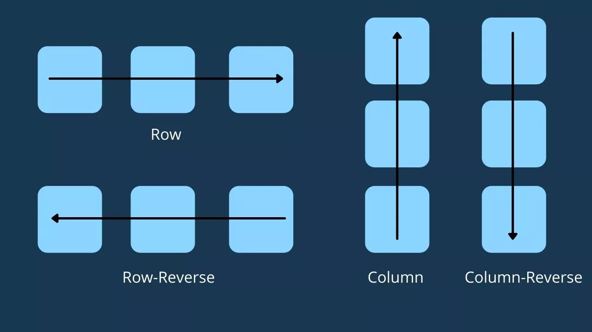
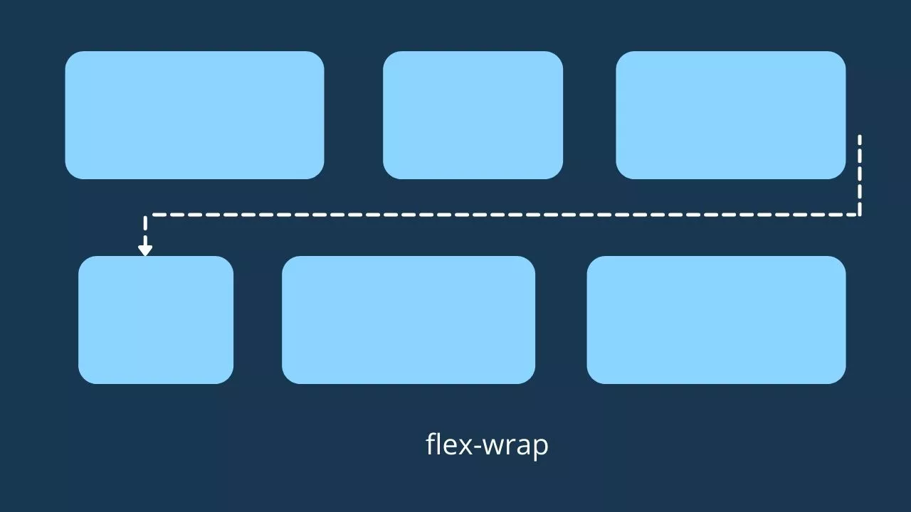
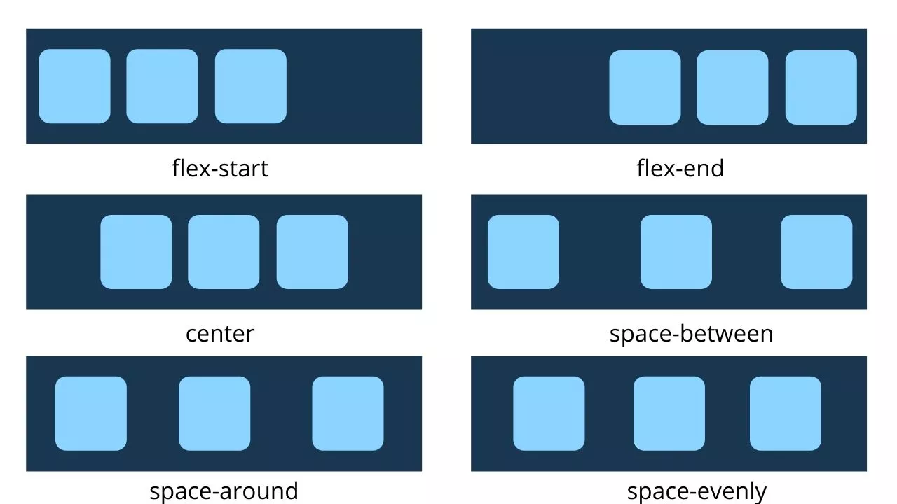
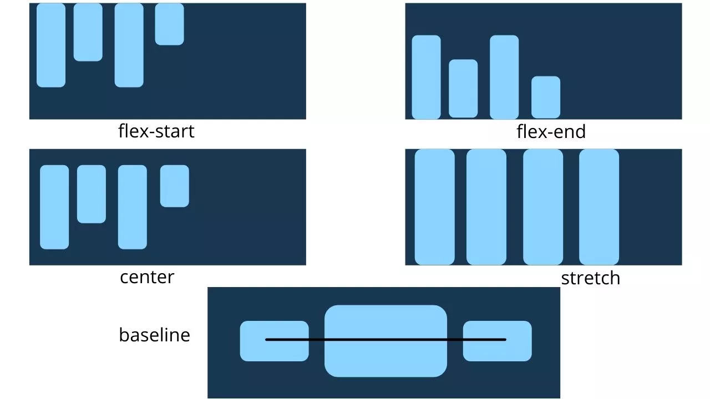
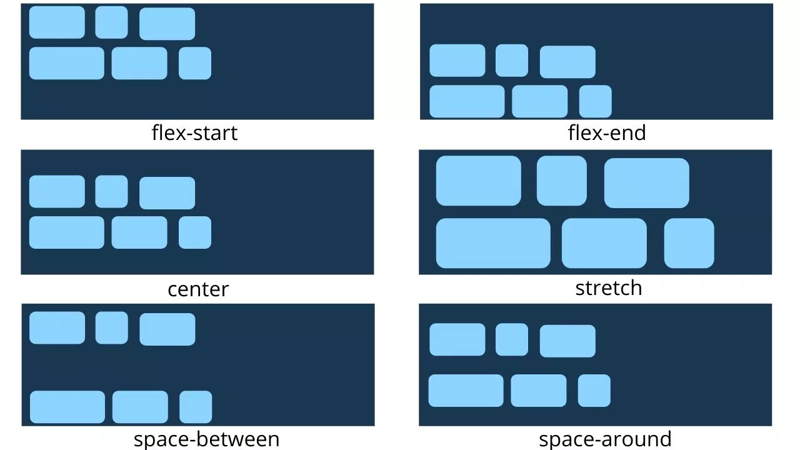

# Propriedades definidas no elemento pai (contêiner flexível)

### `display`

É a propriedade que define um container flexível e coloca todos os itens (elementos filhos) em um contexto flexível.

###### sintaxe:

```css
.container{
    display:flex
}
```

---

### `flex-direction`

Define o eixo principal, ou seja, define em qual direção os itens flexíveis devem ser distribuídos no container.

#### Valores da propriedade:

- **`row`** (default): da esquerda para direita
- **`row-reverse`**: da direita para esquerda
- **`column`**: de cima para baixo
- **`column-reverse`**: de baixo para cima



###### sintaxe:

```css
.container {
    flex-direction: row | row-reverse | column | column-reverse;
}
```

---

### `flex-wrap`

Por padrão, todos os itens flexíveis tentam caber em uma linha, mas usando a propriedade `flex-wrap`;

Podemos definir se os itens flexíveis devem ser encapsulados ou não.

#### Valores da propriedade:

- **`nowrap`**: Este é o valor padrão, todos os itens ficarão na mesma linha
- **`wrap`**: os itens serão distribuídos em múltiplas linhas de cima para baixo
- **`wrap-reverse`**: os itens serão distribuídos em múltiplas linhas de baixo para cima



###### sintaxe:

```css
.container {
    flex-wrap: nowrap | wrap | wrap-reverse;
}
```

---

### `flex-flow`

Esta é a propriedade abreviada para `flex-direction` e `flex-wrap`. Ele permite definir as propriedades  `flex-direction` e `flex-wrap` juntas. 

O valor padrão para esta propriedade é: `row nowrap`.

###### sintaxe:

```css
.container {
    flex-flow: column wrap;
}
```

---

### `justify-content`

Define o alinhamento dos itens flexíveis horizontalmente. Ela permite distribuir o espaço restante no contêiner.

#### Valores da propriedade:

- **`flex-start`**: valor padrão, os itens são distribuídos no inicio de acordo com a propriedade `flex-direction` definida;

- **`flex-end`**: os itens são distribuídos no final de acordo com o `flex-direction` definido;

- **`start`**: os itens são distribuídos no inicio de acordo com o writing-mode;

- **`end`**: os itens são distribuídos no fim de acordo com o writing-mode;

- **`left`**: os itens são distribuídos no lado esquerdo do container, a não ser que isso não faça sentido com a propriedade `flex-direction`, nesse caso se comportando como o `start`;

- **`right`**: os itens são distribuídos no lado direito do container, a não ser que isso não faça sentido com a propriedade `flex-direction`, nesse caso se comportando como o `end`;

- **`center`**: os itens são centralizados;

- **`space-between`**: os itens são distribuídos igualmente, sendo que o primeiro fica junto a borda esquerda, e o último junto a borda direita;

- **`space-around`**: os itens são distribuídos com espaçamento igual entre eles;

- **`space-evenly`**: os itens são distribuídos de forma que os espaços entre dois itens sejam iguais (incluindo espaços nas bordas).



###### sintaxe:

```css
.container {
    justify-content: flex-start | flex-end | center | space-between | space-around | space-evenly | start | end | left | right
}
```

---

### `align-items`

Define o alinhamento dos itens flexíveis verticalmente, seguindo a mesma ideia da propriedade `justify-content`.

#### Valores da propriedade:

- **`stretch`**: valor padrão, ele estica os itens para preencher o container;
- **`flex-start`** / **`start`** / **`self-start`**: os itens são posicionados no topo;
- **`flex-end`** / **`end`** / **`self-end`**: os itens são posicionados na parte de baixo;
- **`center`**: os itens ficam centralizados no eixo vertical;
- **`baseline`**: os itens são alinhas de acordo com suas baselines;



###### sintaxe:

```css
.container {
    align-items: stretch | flex-start | flex-end | center | baseline | first baseline | last baseline | start | end | self-start | self-end + ... safe | unsafe;
}
```

---

### `align-content`

Assim como a propriedade `justify-content`, ele alinha alinha os itens flexíveis dentro do contêiner. Mas é importante notar que essa propriedade não tem efeito caso exista apenas uma linha de itens.

#### Valores da propriedade:

- **normal**: é o valor padrão, os itens são distribuídos na sua posição default;
- **`flex-start`** / **`start`**: os itens são distribuídos no inicio do contêiner;
- **`flex-end`** / **`end`**: os itens são distribuídos no final do contêiner;
- **`center`**: os itens são centralizados no contêiner;
- **`space-between`**: os itens são distribuídos igualmente, sendo que a primeira linha fica no topo e a última no fim do contêiner;
- **`space-around`**: os itens são distribuídos com espaço dividido igualmente entre as linhas;
- **`space-evenly`**: os itens são distribuídos com espaço dividido igualmente entre eles;
- **`stretch`**: os itens de cada linha se esticam para ocupar todo o espaço restante.



###### sintaxe:

```css
```

***

#### FONTE DO CONTEÚDO:

- [W3Schools - Flexbox](https://www.w3schools.com/css/css3_flexbox.asp)

- [CSS TRICKS - Um guia completo para Flexbox](https://css-tricks.com/snippets/css/a-guide-to-flexbox/)
