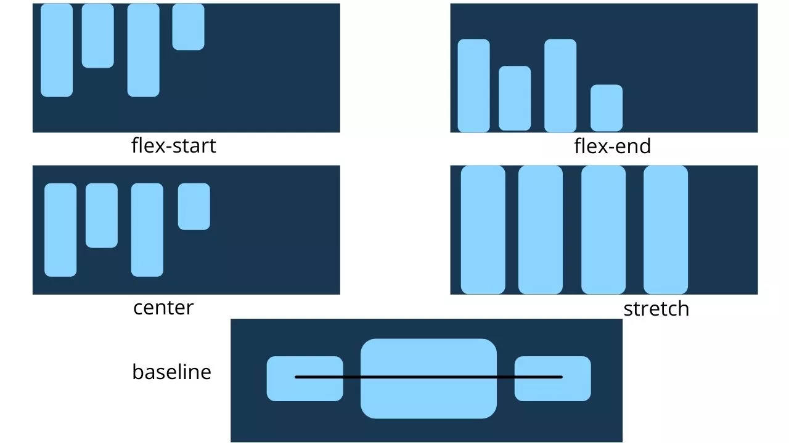

# Propriedades definidas no elemento filho (itens flexíveis)

### `order`

Por padrão os itens flexíveis são distribuídos na ordem que são criados no HTML, porém essa propriedade permite alterar a ordem em que aparecem no contêiner flexível.

###### código HTML:

```html
<div class="container">
    <div class="item1">Item 1</div>
    <div class="item2">Item 2</div>
    <div class="item3">Item 3</div>
    <div class="item4">Item 4</div>
    <div class="item5">Item 5</div>
</div>
```

É possível usar o código abaixo para alterar a ordem dos itens.

###### código CSS:

```css
.item1 {
  order: 3; /*valor padrão é 0*/
}
```

 

---

### `flex-grow`

Define a capacidade de um item flexível crescer em relação ao restante dos itens flexíveis. Ele especifica a quantidade de espaço disponível dentro do contêiner que o item flexível deve ocupar.

Por exemplo, se todos os itens flexível estiverem com a propriedade `flex-grow` com o valor `1`, todo o espaço restante do contêiner será distribuído igualmente entre todos os filhos. Enquanto se um dos itens flexível tiver com a propriedade `flex-grow` com o valor 2, esse item ocupará o dobro do espaço de qualquer um dos outros

###### sintaxe:

```css
.item {
  flex-grow: 3; /*valor padrão é 0*/
}
```


---

### `flex-shrink`

Define a capacidade de um item flexível diminuir em relação ao restante dos itens flexíveis. Ele especifica o fator `flex-shrink`, determinando quanto o item flexível diminuirá quando não houver espaço suficiente no contêiner flexível.

O valor desta propriedade deve ser um número positivo e o valor padrão é 1.

###### sintaxe:

```css
.item {
  flex-shrink: 3; /*valor padrão é 1*/
}
```


---

### `flex-basis`

Define o tamanho inicial de um item flexível antes que o espaço restante seja distribuído entre os itens flexíveis. Podemos definir o valor da base flexível em comprimento (50%, 250px, 5rem) ou palavra-chave (`auto`, `content`). A palavra-chave `auto` significa que ele terá o tamanho de altura e largura definido nas suas propriedades, já a palavra `content` quer dizer que ele irá respeitar o tamanho do seu conteúdo.

###### sintaxe:

```css
.item {
    flex-basis:  | auto; /* default auto */
}
```

---

### `flex`

Essa propriedade é a abreviação das propriedades `flex-grow`, `flex-shrink` e `flex-basis`. O segundo e o terceiro parâmetro são opcionais. O valor padrão é: `0` `1` `auto`. É recomendado usar essa propriedade ao invés de cada uma individualmente.

###### sintaxe:

```css
.item {
    flex: none | [ <'flex-grow'> <'flex-shrink'>? || <'flex-basis'> ]
}
```

---

### `align-self`

Essa propriedade permite que o alinhamento padrão (`align-item`) especificado no contêiner flexível, seja substituído por itens flexíveis individuais. 

Os valores disponíveis são os mesmos do da propriedade `align-items`.

###### sintaxe:

```css
.item {
    align-self: auto | flex-start | flex-end | center | baseline | stretch;
}
```



***

**FONTE DO CONTEÚDO**:

- [W3Schools - Flexbox](https://www.w3schools.com/css/css3_flexbox.asp)

- [CSS TRICKS - Um guia completo para Flexbox](https://css-tricks.com/snippets/css/a-guide-to-flexbox/)
- [WCore - Itens e propriedades do CSS Flex](https://widgetcore.com/a-complete-guide-to-css-flex-items-properties/)
